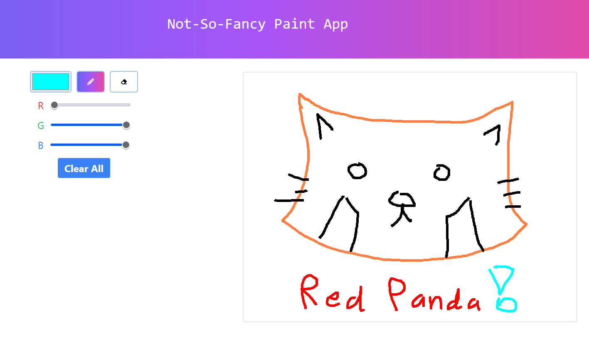

# 512-paint-react

This is a React implementation for Lab 3 in CIS 4120/5120. It is a basic paint app used to demonstrate basic usage of React for UI/UX for web development.

Website Deployment: https://512-paint-react.vercel.app/

